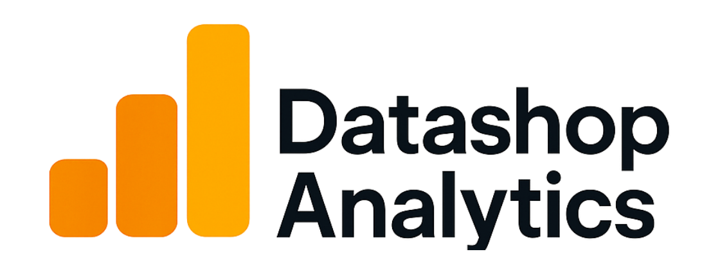

# 🛒 DataShop Analytics: Predictor de Intención de Compra 📊

<div align="center">
    
    <br><br>
    
    
</div>

> *Anticipa las intenciones de tus clientes y optimiza tu estrategia de conversión con inteligencia artificial...*

¡Bienvenido a DataShop Analytics! Una potente aplicación que utiliza machine learning para predecir el comportamiento de compra de usuarios en tiendas online. Aprovechando datos reales de Google Analytics, este sistema predice qué visitantes tienen mayor probabilidad de realizar una conversión, permitiéndote optimizar tus estrategias de marketing y UX.

## 🧠 Inteligencia al Servicio del E-Commerce 🧠

DataShop Analytics transforma tus datos de navegación en predicciones accionables. Nuestra aplicación proporciona:

- **Dashboard interactivo** con métricas clave de conversión
- **Simulador de comportamiento** para modelar escenarios de usuarios
- **Historial detallado** de predicciones para análisis a largo plazo
- **Recomendaciones estratégicas** basadas en los patrones detectados

## 🔍 El Origen del Proyecto 🔍

Todo comenzó cuando un equipo de analistas de datos se propuso aprovechar el dataset de comportamiento de compra online de UCI:

1. **Análisis Exploratorio Profundo** 🔎: Exploramos exhaustivamente el conjunto de datos, descubriendo patrones y relaciones entre el comportamiento de navegación y las conversiones. Detectamos factores clave como el valor de página, temporalidad y tipo de visitante.

2. **Experimentación con Múltiples Algoritmos** 🧪: Implementamos y comparamos diversos modelos de clasificación:
   - XGBoost: El modelo equilibrado
   - LightGBM: El algoritmo eficiente
   - Random Forest: El enfoque de conjunto
   - SVM: El clasificador vectorial

3. **XGBoost: El Modelo Campeón** 👑: Tras rigurosas pruebas y un [análisis comparativo detallado](notebooks/modelo_analisis_comparativo_clasificacion.md), nuestro modelo XGBoost optimizado destacó con:
   - **Precisión en prueba (Accuracy)**: 0.8948
   - **F1-score** (clase positiva): 0.69
   - **Precision** (clase positiva): 0.64
   - **Recall** (clase positiva): 0.75
   - **AUC-ROC**: 0.9327
   - **Indicador de overfitting**: 0.0401 (controlado)

4. **Aplicación Web en Streamlit** 🌐: Transformamos el modelo en una herramienta intuitiva y accionable para quienes toman decisiones en e-commerce.

## 💻 Características Innovadoras 💻

* **Visualización de Métricas** 📈: Dashboard interactivo con KPIs de conversión
* **Simulador de Escenarios** 🎮: Prueba diferentes comportamientos de usuario
* **Recomendaciones de Marketing** 💡: Estrategias personalizadas basadas en predicciones
* **Almacenamiento en SQLite** 💾: Historial persistente de predicciones
* **Interfaz Intuitiva** 🖱️: Experiencia de usuario clara y accesible
* **Pipeline Dockerizado** 🐳: Implementación rápida y sin complicaciones

## ⚙️ Pila Tecnológica ⚙️


## 📁 Estructura del Proyecto 📁

```
proyecto-clasificacion-grupo6/
├── app/                          # Núcleo de la aplicación
│   ├── app.py                    # Punto de entrada principal
│   ├── assets/                   # Recursos estáticos (imágenes, etc.)
│   ├── config.py                 # Configuraciones de la aplicación
│   ├── data_utils.py             # Utilidades para manejo de datos
│   ├── db_manager.py             # Gestor de base de datos SQLite
│   ├── db_models.py              # Modelos ORM para SQLAlchemy
│   ├── model_utils.py            # Utilidades para cargar y usar modelos ML
│   ├── pages/                    # Páginas de la aplicación
│   │   ├── dashboard.py          # Página de dashboard principal
│   │   ├── history.py            # Página de historial de predicciones
│   │   └── simulator.py          # Simulador de comportamiento
│   ├── ui_components.py          # Componentes de interfaz reutilizables
│   └── utils.py                  # Utilidades generales
├── data/                         # Datos del proyecto (a crear)
│   ├── clean/                    # Dataset procesado y limpio
│   │   └── online_shoppers_clean.csv
│   ├── database/                 # Base de datos SQLite (generada)
│   │   └── onlineshopping.db
│   └── raw/                      # Dataset original
│       └── online_shoppers_intention.csv
├── notebooks/                    # Notebooks de análisis y modelado
│   ├── eda_shoppers_explained_and.ipynb # Análisis exploratorio de datos
│   └── modeling/                 # Carpetas de modelos
│       ├── lightgbm/             # Modelo LightGBM
│       │   ├── lightgbm_model.ipynb
│       │   ├── lightgbm_model.pkl
│       │   ├── lightgbm_preprocessor.pkl
│       │   └── model_lightgbm.ipynb
│       ├── random_forest/        # Modelo Random Forest
│       │   ├── export_models/    # Modelos exportados
│       │   │   ├── random_forest_model_base.pkl
│       │   │   ├── random_forest_optimized.pkl
│       │   │   └── random_forest_preprocessor.pkl
│       │   └── random_forest.ipynb
│       ├── SVM/                  # Modelo SVM
│       │   ├── export_models/    # Modelos exportados
│       │   │   └── svm_final_model.joblib
│       │   └── SVM.ipynb
│       └── xgboost/              # Modelo XGBoost (seleccionado)
│           ├── pkl_exports/      # Modelos exportados
│           │   ├── xgboost_model_base.pkl
│           │   ├── xgboost_optimized.pkl
│           │   └── xgboost_preprocessor.pkl
│           └── xgboost.ipynb
├── tests/                        # Pruebas automatizadas 
│   └── .gitkeep
│   └──__init.py__
│   └── conftest.py
│   └── test_db_manager.py        # Test de integración
│   └── test_model_utils.py       # Test unitarios
├── .dockerignore                 # Archivos ignorados por Docker
├── .env                          # Variables de entorno
├── .env.example                  # Ejemplo de variables de entorno
├── .gitignore                    # Archivos ignorados por Git
├── Dockerfile                    # Configuración para contenerización
├── pyproject.toml                # Dependencias del proyecto
├── requirements.docker.txt       # Requisitos para Docker
├── requirements.txt              # Requisitos detallados
└── README.md                     # Este archivo
```

## 🚀 Instalación y Uso 🚀

### Requisitos previos

1. **Descarga del Dataset**

   Antes de comenzar, debes descargar el dataset de [UCI Machine Learning Repository](https://archive.ics.uci.edu/dataset/468/online+shoppers+purchasing+intention+dataset) y colocarlo en la carpeta `data/raw/`.

2. **Estructura de carpetas**

   Crea la siguiente estructura de carpetas si no existe:
   ```
   data/
   ├── raw/         # Coloca aquí el dataset descargado
   ├── clean/       # Se generará automáticamente
   └── database/    # Se generará automáticamente
   ```

### Instalación con Docker (Recomendada)

La forma más sencilla de ejecutar DataShop Analytics es utilizando Docker:

```bash
# Construir la imagen
docker build -t clasificacion-app .

# Ejecutar el contenedor
docker run -p 8501:8501 clasificacion-app
```

Accede a la aplicación navegando a `http://localhost:8501` en tu navegador.

### Instalación Manual

1. **Clonar el repositorio:**
   ```bash
   git clone <url-repo>
   cd proyecto-clasificacion
   ```

2. **Crear entorno virtual:**
   ```bash
   python -m venv venv
   source venv/bin/activate  # En Windows: venv\Scripts\activate
   ```

3. **Instalar dependencias:**
   ```bash
   pip install -r requirements.txt
   ```

4. **Configurar archivo .env:**
   ```
   # CONFIGURACIÓN DE LA BASE DE DATOS
   # Ruta al directorio data donde se almacenarán los datos de la aplicación
   DATA_PATH = 'data/database'
   # Nombre del archivo de base de datos
   DB_FILENAME = 'onlineshopping.db'
   # Cadena de conexión a la base de datos (SQLite)
   DB_URI = 'sqlite:///data/database/onlineshopping.db'
   ```

5. **Ejecutar la aplicación:**
   ```bash
   streamlit run app/app.py
   ```
### Ejecutar Tests 
 ```bash
   pytest app/tests
   ```
## 🌐 Despliegue en AWS 🌐

DataShop Analytics está desplegado y disponible para uso en AWS:

- **URL de acceso**: [13.48.190.206](http://13.48.190.206/)

La aplicación está alojada en una instancia EC2 de AWS, lo que permite un acceso sencillo desde cualquier navegador sin necesidad de instalación local.

## 📊 Uso de la Aplicación 📊

1. **Dashboard**: Visualiza métricas clave sobre tasas de conversión y comportamiento de usuarios.

2. **Simulador**: Introduce características de comportamiento de usuario para predecir la probabilidad de compra.

3. **Historial**: Explora predicciones anteriores y filtra por diferentes criterios.

Cada sección proporciona insights accionables para optimizar tus estrategias de marketing y aumentar las conversiones en tu tienda online.

## 👥 Equipo de Desarrollo 👥

* [**Maryna Nalyvaiko (Scrum Master)**](https://github.com/MarynaDRST) - Coordinación del proyecto y gestión ágil
* [**Fernando García Catalán**](https://github.com/fergarcat) - Equipo de desarrollo
* [**Stephany Angeles**](https://github.com/stephyangeles) - Equipo de desarrollo
* [**Pepe Ruiz**](https://github.com/peperuizdev) - Equipo de desarrollo

## 📜 Licencia 📜

Proyecto bajo Licencia de Factoría F5: Aprender, Compartir y Citar la Fuente.

---

*"Convierte datos en decisiones y visitantes en clientes"*

*Desarrollado con ❤️ por el equipo DataShop Analytics* 🚀
