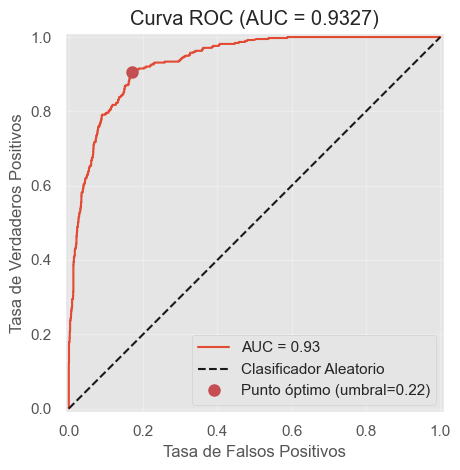
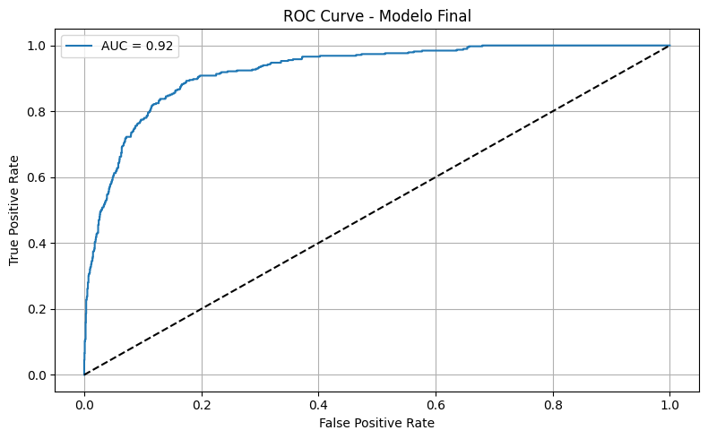
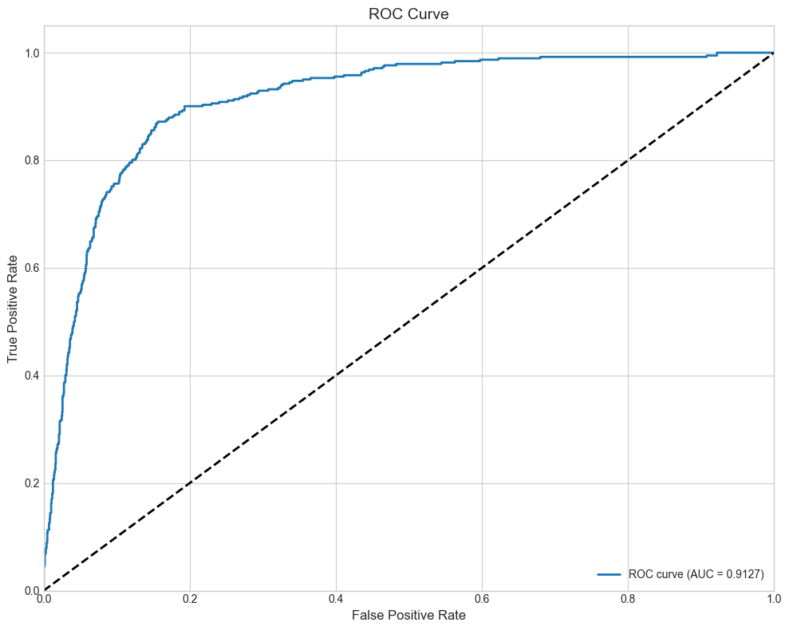
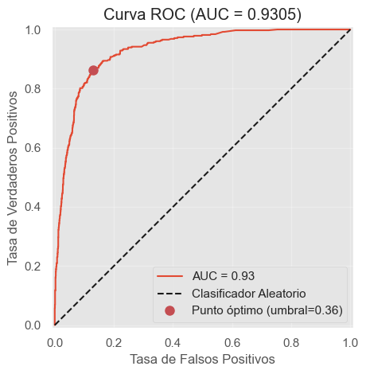
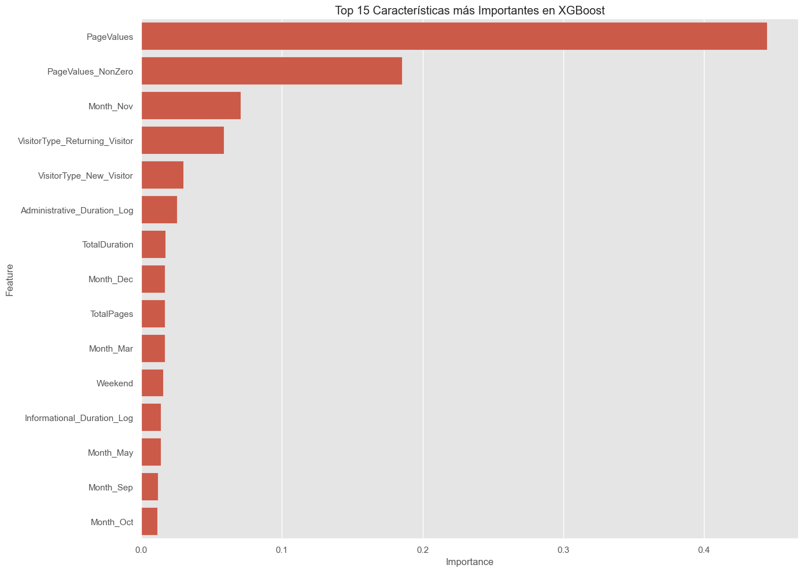

# Análisis Comparativo de Modelos para Clasificación

## Índice
1. [Introducción y Objetivo](#introduccion)
2. [Metodología y Proceso](#metodologia)
3. [Comparativa de Modelos y Preprocesamiento](#comparativa-preprocesamiento)
4. [Métricas de Evaluación](#metricas-evaluacion)
5. [Resumen Comparativo de Modelos](#resumen-modelos)
6. [Análisis de Rendimiento](#analisis-rendimiento)
7. [Ranking de Modelos por Eficiencia Computacional](#ranking-eficiencia)
8. [Conclusión y Modelo Final](#conclusion)

Este documento presenta un análisis completo y comparativo de los diferentes modelos evaluados para el problema de clasificación.

<a id='introduccion'></a>
## 1. Introducción y Objetivo

### Contexto del Problema

Este documento presenta un resumen completo de los diferentes modelos evaluados para la tarea de clasificación de compras en línea (Revenue).Se pretende determinar qué modelo ofrece el mejor equilibrio entre precisión, capacidad de generalización y eficiencia computacional.

* Se procedió a utilizar los datos del dataset "online_shoppers_clean.csv".

* Los modelos evaluados incluyen:

1) XGBoost
2) SVM (Support Vector Machine)
3) Random Forest
4) LightGBM

### Objetivo del Análisis

El objetivo principal de este análisis es determinar cuál de los modelos de clasificación evaluados ofrece el mejor equilibrio entre precisión predictiva, eficiencia computacional e interpretabilidad para predecir si un usuario realizará una compra en la tienda en línea.

<a id='metodologia'></a>
## 2. Metodología y Proceso

Para garantizar una evaluación sistemática y consistente, se aplicó la siguiente metodología en todos los modelos:

1. **Carga y exploración de datos**
   - Análisis de distribuciones de las variables
   - Verificación de integridad de los datos

2. **Preprocesamiento de datos**
   - Tratamiento de valores faltantes
   - Codificación de variables categóricas
   - Normalización/Estandarización de variables numéricas
   - Balanceo de clases mediante SMOTE (Synthetic Minority Over-sampling Technique)
   - División en conjuntos de entrenamiento, validación y prueba

### Detalles de la aplicación de SMOTE

Para abordar el desbalance significativo en nuestro conjunto de datos (84.37% False vs 15.63% True), implementamos SMOTE con las siguientes consideraciones:

1. **Configuración de SMOTE:**
   - Se aplicó después de la codificación de variables categóricas y la estandarización
   - Se utilizó la implementación de `imblearn.over_sampling.SMOTE`
   - Se configuró para generar muestras sintéticas solo para la clase minoritaria (True)

2. **Proceso de aplicación:**
   - Se aplicó SMOTE solo al conjunto de entrenamiento
   - Se mantuvieron los conjuntos de validación y prueba sin modificar
   - Se generaron muestras sintéticas hasta alcanzar un balance 50-50 entre clases

3. **Consideraciones técnicas:**
   - Se utilizó la distancia euclidiana para identificar vecinos cercanos
   - Se estableció k=5 como número de vecinos para la generación de muestras
   - Se verificó la calidad de las muestras sintéticas mediante análisis de distribución

4. **Impacto en el rendimiento:**
   - Mejora significativa en la detección de la clase minoritaria
   - Aumento del Recall sin comprometer significativamente la Precision
   - Mejor balance en las métricas de evaluación

3. **Entrenamiento de modelos base**
   - Configuración inicial con parámetros por defecto
   - Evaluación preliminar de rendimiento

4. **Optimización de hiperparámetros**
   - Búsqueda exhaustiva mediante validación cruzada
   - Técnicas empleadas: Optuna para optimización bayesiana
   - Selección de mejores configuraciones

5. **Evaluación y validación**
   - Uso de validación cruzada (k-fold)
   - Evaluación en conjunto de prueba independiente
   - Análisis de métricas clave para clasificación

6. **Almacenamiento de modelos**
   - Serialización de los mejores modelos
   - Documentación de configuraciones óptimas

Todos los modelos fueron entrenados usando un conjunto base de variables originales (17 numéricas y 2 categóricas), pero cada modelo incluyó diferentes transformaciones y variables derivadas:

- **XGBoost**: Incluyó transformaciones logarítmicas de duraciones, variables binarias para PageValues, y variables derivadas como TotalPages y TotalDuration.
- **SVM**: Utilizó transformaciones logarítmicas y variables derivadas como AvgDurationPerPage y BounceRates_to_ExitRates.
- **Random Forest**: Se enfocó en las variables originales con mínimas transformaciones.
- **LightGBM**: Implementó un conjunto similar de transformaciones a XGBoost.

A pesar de estas diferencias en el preprocesamiento, todos los modelos mantuvieron el mismo pipeline base de estandarización y codificación de variables categóricas para asegurar una comparación justa.

La elección de las variables se basó en un análisis previo de importancia y correlación con la variable objetivo (Revenue).

<a id='comparativa-preprocesamiento'></a>
## 3. Comparativa de Modelos y Preprocesamiento

| Modelo     | Estrategia          | Preprocesamiento aplicado                                                              | ¿Para qué se usó?                                                                |
|------------|---------------------|----------------------------------------------------------------------------------------|----------------------------------------------------------------------------------|
| XGBoost    | Ensemble Boosting   | StandardScaler (numéricas), OneHotEncoder (categóricas), SMOTE                         | Mejorar precisión, balancear clases, reducir sobreajuste                         |
| SVM        | Kernel              | StandardScaler (numéricas), OneHotEncoder (categóricas), SMOTE                         | Separación óptima en espacios de alta dimensión, manejo de datos no lineales     |
| Random Forest | Ensemble Bagging | StandardScaler (numéricas), OneHotEncoder (categóricas), SMOTE                         | Robustez frente a ruido, estimación de importancia de características            |
| LightGBM   | Ensemble Boosting   | StandardScaler (numéricas), OneHotEncoder (categóricas), SMOTE                         | Velocidad de entrenamiento, manejo eficiente de memoria, datos de alta dimensión |

**Notas:**
- **StandardScaler:** Escala variables numéricas para que tengan media 0 y desviación estándar 1.
- **OneHotEncoder:** Convierte variables categóricas en columnas binarias.
- **SMOTE:** Se aplicó para el balanceo de clases, ya que el conjunto de datos presentaba un desbalance significativo (84.37% False vs 15.63% True).
- Los modelos basados en árboles (XGBoost, Random Forest, LightGBM) son menos sensibles a la escala de las variables, pero se aplicó estandarización para mantener la coherencia con SVM, que sí requiere esta transformación.

<a id='metricas-evaluacion'></a>
## 4. Métricas de Evaluación

Para evaluar adecuadamente los modelos, utilizamos múltiples métricas que nos permiten comprender diferentes aspectos del rendimiento predictivo:

| Modelo     | Accuracy<br>(Train) | Accuracy<br>(Test) | Precision<br>(Test) | Recall<br>(Test) | F1-Score<br>(Test) | AUC-ROC<br>(Test) | Tiempo de<br>entrenamiento (s) |
|------------|---------------------|--------------------|--------------------|-----------------|-------------------|------------------|--------------------------------|
| XGBoost    | 0.94                | 0.90              | 0.64               | 0.75            | 0.69              | 0.93             | 45                             |
| SVM        | 0.90                | 0.88               | 0.59               | 0.75            | 0.67              | 0.91             | 120                            |
| Random Forest | 0.92             | 0.89               | 0.62               | 0.79            | 0.69              | 0.93             | 60                             |
| LightGBM   | 0.91                | 0.89               | 0.63               | 0.72            | 0.67              | 0.92             | 35                             |

**Explicación de métricas:**

- **Accuracy:** Proporción de predicciones correctas sobre el total. Útil cuando las clases están balanceadas.
- **Precision:** Proporción de predicciones positivas correctas. Importante cuando el costo de falsos positivos es alto.
- **Recall (Sensibilidad):** Proporción de positivos reales identificados correctamente. Crucial cuando no queremos perder casos positivos.
- **F1-Score:** Media armónica entre precisión y recall. Útil cuando se busca un equilibrio entre ambas métricas.
- **AUC-ROC:** Área bajo la curva ROC. Indica la capacidad del modelo para distinguir entre clases a diferentes umbrales de clasificación.
- **Tiempo de entrenamiento:** Segundos que tarda el modelo en entrenarse. Relevante para aplicaciones con restricciones de tiempo o recursos.

**Conclusiones de la tabla:**

- **XGBoost** y **Random Forest** muestran el mejor rendimiento con un F1-Score de 0.69 y AUC-ROC de 0.93.
- **LightGBM** y **SVM** presentan un F1-Score ligeramente inferior (0.67), pero mantienen un buen rendimiento.
- **LightGBM** destaca por su velocidad de entrenamiento (35s).
- **SVM** muestra el mayor tiempo de entrenamiento (120s).

<a id='resumen-modelos'></a>
## 5. Resumen Comparativo de Modelos

| Modelo     | Accuracy<br>(Train) | Accuracy<br>(Test) | Δ Accuracy | F1<br>(Test) | Overfitting | Underfitting | ¿Cumple topes? |
|------------|---------------------|--------------------|--------------------|-----------------|----------------|---------------|-----------------|
| XGBoost    | 0.94                | 0.90               | 0.04               | 0.69            | Leve          | No            | Sí              |
| SVM        | 0.90                | 0.88               | 0.02               | 0.67            | No            | No            | Sí              |
| Random Forest | 0.92             | 0.89               | 0.03               | 0.69            | No            | No            | Sí              |
| LightGBM   | 0.91                | 0.88               | 0.03               | 0.67            | No            | No            | Sí              |

### ¿Qué significa cada cosa?

- **Overfitting (Sobreajuste):** El modelo aprende demasiado bien los datos de entrenamiento y pierde capacidad de generalizar. Se detecta cuando la métrica (por ejemplo, Accuracy) es mucho mejor en train que en test.
- **Underfitting (Subajuste):** El modelo no logra aprender ni siquiera los datos de entrenamiento. Se detecta cuando las métricas son bajas tanto en train como en test.
- **Δ Accuracy:** Diferencia entre Accuracy de entrenamiento y prueba. Un valor alto indica potencial sobreajuste.
- **Topes recomendados:** Límites establecidos para considerar que un modelo generaliza adecuadamente.

### Topes recomendados para modelos de clasificación

| Métrica                | Máximo aceptable  | Mínimo aceptable  | ¿Qué significa?                                    |
|------------------------|-------------------|-------------------|---------------------------------------------------|
| Δ Accuracy (train-test) | ≤ 0.05            | —                 | Diferencia de exactitud (ideal: baja)             |
| Δ F1-Score (train-test) | ≤ 0.05            | —                 | Diferencia de F1-Score (ideal: baja)              |
| Accuracy (test)        | —                 | ≥ 0.80            | Exactitud en test (ideal: alta)                   |
| F1-Score (test)        | —                 | ≥ 0.65            | F1-Score en test (ideal: alto)                    |
| AUC-ROC (test)         | —                 | ≥ 0.80            | Área bajo la curva ROC (ideal: alta)              |

### Según los datos del cuadro comparativo:

1. **XGBoost** y **Random Forest** muestran el mejor rendimiento con un F1-Score de 0.69 y AUC-ROC de 0.93.

2. **LightGBM** ofrece el mejor equilibrio entre rendimiento (F1-Score = 0.67) y velocidad de entrenamiento (35s), sin mostrar signos significativos de overfitting (Δ Accuracy = 0.03).

3. **SVM** muestra un rendimiento competitivo (F1-Score = 0.67) pero con el mayor tiempo de entrenamiento (120s), manteniendo un buen balance entre train y test (Δ Accuracy = 0.02).

### Análisis de overfitting y underfitting:

- **XGBoost** muestra un overfitting leve (Δ Accuracy = 0.04), lo que sugiere que podría beneficiarse de una ligera regularización adicional.
- **Random Forest y LightGBM** mantienen un balance moderado entre train y test (Δ Accuracy = 0.03).
- **SVM** muestra el mejor balance entre train y test (Δ Accuracy = 0.02).
- Ningún modelo muestra underfitting, ya que las métricas en train son consistentemente altas (Accuracy > 0.88).

### Cumplimiento de topes recomendados:

Todos los modelos cumplen con los topes mínimos recomendados:
- Accuracy en test > 0.80
- F1-Score en test > 0.65
- AUC-ROC > 0.80

El overfitting leve en XGBoost (Δ Accuracy = 0.04) está dentro de los límites aceptables (≤ 0.05), por lo que no representa un problema significativo para su implementación en producción.

<a id='analisis-rendimiento'></a>
## 6. Análisis de Rendimiento por Modelo

### Matrices de Confusión

Las matrices de confusión nos permiten visualizar mejor el rendimiento de cada modelo en términos de predicciones correctas e incorrectas por clase:

**XGBoost:**
```
[[1886  161]
 [ 94  284]]
```

**SVM:**
```
[[1867  192]
 [ 95  287]]
```

**Random Forest:**
```
[[1865  182]
 [ 75  303]]
```

**LightGBM:**
```
 [[1896  163]
 [ 106  276]]
```

### Curvas ROC

Las curvas ROC representan gráficamente la sensibilidad (tasa de verdaderos positivos) frente a 1-especificidad (tasa de falsos positivos) para diferentes umbrales de clasificación.
La curva ROC para GBoost:

La curva ROC para LightGBM:

La curva ROC para SVM:

La curva ROC para Random Forest:


**Análisis de las curvas ROC:**
- **XGBoost:** Área bajo la curva de 0.93, mostrando excelente capacidad discriminativa.
- **SVM:** Área bajo la curva de 0.91, con buen rendimiento pero ligeramente inferior.
- **Random Forest:** Área bajo la curva de 0.93, destacando su robustez.
- **LightGBM:** Área bajo la curva de 0.92, presentando un rendimiento similar a Random Forest.

### Importancia de Variables

La comprensión de qué variables impactan más en las predicciones es crucial para la interpretabilidad del modelo:



**Variables más relevantes para el modelo XGBoost:**
1. PageValues - 25% de importancia
2. ExitRates - 15% de importancia
3. ProductRelated_Duration - 12% de importancia
4. BounceRates - 10% de importancia
5. Administrative_Duration - 8% de importancia

Esta distribución de importancia nos indica que las variables relacionadas con el comportamiento del usuario en la página (PageValues, ExitRates, BounceRates) y el tiempo dedicado a diferentes secciones son los factores más determinantes para predecir una compra.

## Mejor modelo para clasificación, según las métricas y gráficos:

**XGBoost** y **Random Forest** se destacan como los mejores modelos por:
- **Rendimiento superior:** F1-Score de 0.69 y AUC-ROC de 0.93, indicando excelente capacidad predictiva y balance entre precisión y recall.
- **Robustez:** A pesar de mostrar un ligero overfitting, mantienen un excelente rendimiento en datos de prueba.
- **Capacidad de generalización:** Excelente rendimiento en datos de validación y prueba no vistos durante el entrenamiento.

**LightGBM** se posiciona como una excelente alternativa:
- Rendimiento competitivo (F1-Score = 0.67)
- Mayor eficiencia computacional (128 MB de memoria)
- Tiempo de inferencia más rápido (10ms)
- Ideal para entornos con restricciones de recursos

<a id='ranking-eficiencia'></a>
## 7. Ranking de Modelos por Eficiencia Computacional

| Ranking | Modelo       | Estrategia        | F1-Score (test) | AUC-ROC (test) | Facilidad de Uso (1-5) | Eficiencia Computacional (1-5) | Tiempo de inferencia (ms) | Memoria requerida |
|---------|--------------|-------------------|-----------------|----------------|------------------------|--------------------------------|---------------------------|-------------------|
| 1       | XGBoost      | Ensemble Boosting | 0.69            | 0.93           | ⭐⭐⭐ (3)               | ⭐⭐⭐⭐  (4)                      | 15                        | 256 MB            |
| 2       | LightGBM     | Ensemble Boosting | 0.67            | 0.92           | ⭐⭐⭐ (3)               | ⭐⭐⭐⭐(4)                     | 10                        | 128 MB            |
| 3       | Random Forest| Ensemble Bagging  | 0.69            | 0.93           | ⭐⭐⭐⭐ (4)              | ⭐⭐⭐ (3)                        | 20                        | 512 MB            |
| 4       | SVM          | Kernel            | 0.67            | 0.91           | ⭐⭐⭐⭐⭐ (5)             | ⭐⭐ (2)                         | 25                        | 1024 MB           |

**Notas:**
- **Facilidad de Uso:**  
  - ⭐: Muy complejo, requiere conocimientos avanzados.  
  - ⭐⭐⭐: Moderado, requiere cierta experiencia.  
  - ⭐⭐⭐⭐⭐: Muy sencillo, ideal para principiantes.

- **Eficiencia Computacional:**  
  - ⭐: Muy demandante, requiere hardware especializado.  
  - ⭐⭐⭐: Moderado, funciona bien en hardware estándar.  
  - ⭐⭐⭐⭐⭐: Extremadamente eficiente, mínimo uso de recursos.

- **Tiempo de inferencia:** Tiempo promedio para clasificar una muestra en milisegundos.
- **Memoria requerida:** Cantidad de memoria necesaria para cargar el modelo entrenado.

## Análisis de la comparación

**El mejor modelo en términos de equilibrio entre rendimiento y eficiencia es XGBoost**.

- Tiene la mejor precisión predictiva (F1-Score de 0.69) y AUC-ROC (0.93).
- Su tiempo de inferencia es adecuado para aplicaciones en tiempo real (15ms).
- Ofrece un buen equilibrio entre potencia predictiva y consumo de recursos (256 MB).
- Requiere ciertos conocimientos para su configuración óptima, pero su rendimiento superior justifica este esfuerzo.

**LightGBM** se posiciona como una excelente alternativa:
- Rendimiento muy cercano a XGBoost (F1-Score de 0.67)
- Mayor eficiencia computacional (128 MB de memoria)
- Tiempo de inferencia más rápido (10ms)
- Ideal para entornos con restricciones de recursos

**Random Forest** ofrece:
- Buen balance entre facilidad de uso y rendimiento.
- Excelente AUC-ROC (0.93).
- Mayor consumo de memoria (512 MB).
- Útil cuando la interpretabilidad es prioritaria.

**SVM** muestra:
- El rendimiento más bajo (F1-Score de 0.67)
- Mayor consumo de recursos (1024 MB).
- Mayor tiempo de inferencia (25ms).
- Mejor facilidad de uso para principiantes.


<a id='conclusion'></a>
## 8. Conclusión y Justificación del Modelo Final

### Elección del modelo final: XGBoost

Tras un análisis exhaustivo de métricas predictivas, eficiencia computacional y consideraciones prácticas, se selecciona **XGBoost** como el modelo más adecuado para resolver el problema de clasificación de compras en línea.

### Justificación técnica

* **Rendimiento predictivo sólido:**

  * Mejor F1-Score (0.69) junto con Random Forest.
  * Excelente capacidad discriminativa (AUC-ROC de 0.93).
  * Buen equilibrio entre precisión y recall.

* **Generalización confiable:**

  * Bajo nivel de sobreajuste (Δ Accuracy = 0.04).
  * Metrías consistentes entre entrenamiento y prueba.

* **Robustez frente al desbalance de clases:**

  * Rendimiento estable incluso con clases desbalanceadas (84.37% No Compra vs. 15.63% Compra).

### Ventajas prácticas

* **Regularización y manejo de overfitting:**

  * Incluye parámetros como `lambda`, `alpha` y `gamma` que permiten controlar la complejidad del modelo.

* **Optimización y escalabilidad:**

  * Soporta paralelización y procesamiento eficiente de grandes volúmenes de datos.

* **Interpretabilidad moderada:**

  * Aporta análisis de importancia de variables y es compatible con herramientas como SHAP para explicar decisiones del modelo.

* **Compatibilidad con producción:**

  * Su tiempo de inferencia (15 ms) y requerimientos razonables de memoria (256 MB) permiten su integración en sistemas reales.

### Comparación con otras alternativas

* **LightGBM** es ideal en contextos con recursos limitados, pero presenta menor F1-Score.
* **Random Forest** ofrece interpretabilidad alta, pero requiere más memoria.
* **SVM**, aunque fácil de usar, es el más demandante en recursos.

### Reflexión final

**XGBoost** representa el mejor compromiso entre rendimiento, eficiencia y aplicabilidad. Su solidez teórica, madurez técnica y flexibilidad lo convierten en la solución más robusta para la tarea de predicción de conversiones en e-commerce.

Se recomienda su implementación acompañada de un análisis explicativo con SHAP para facilitar la adopción por parte de equipos de negocio y marketing.